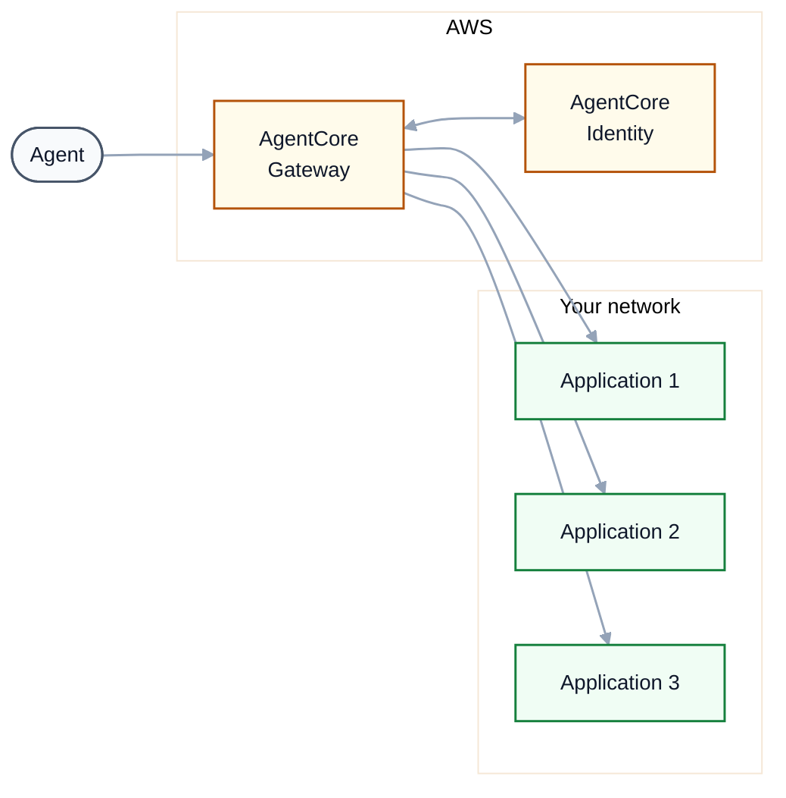
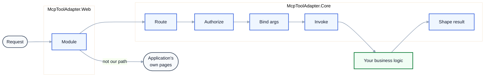
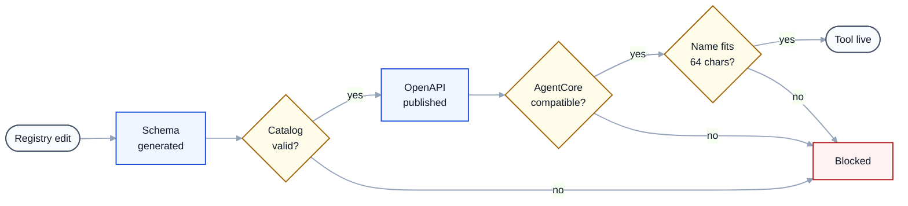
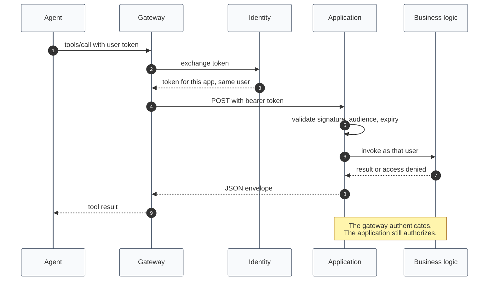

# Architecture

Four views, each deliberately kept to one idea. Detail lives in the prose under each diagram rather
than inside the boxes.

## 1. Where things sit

One gateway, one target per application. Agents connect once.

Two authentication hops, not one. The agent authenticates to the gateway; the gateway separately
authenticates to each application. Identity handles token storage and, in on-behalf-of mode, exchanges
the agent's token for one scoped to the target application.

Tools reach the agent as `orderapp___get_order_by_id`. AgentCore prefixes every operation with its
target name, which is why each application is its own target and why target names stay short.

## 2. Inside one application

A straight line. Everything reusable is in the zero-dependency core; the `System.Web` box is an
adapter.

The module's first act is a single string comparison; anything that isn't ours passes straight through
untouched. That is the whole cost imposed on the application's normal traffic.

Three things happen at **Invoke** that are worth naming. The method is called through a delegate
compiled once at startup, not through reflection. `PrincipalScope` establishes the end user on
`HttpContext.Current.User` for the duration of the call and restores the previous value afterwards, so
existing `User.IsInRole` checks still govern access. **Shape result** flattens `DataTable`, caps
collection size, and normalises dates to ISO 8601.

## 3. From code change to live tool

Three gates. Each one converts a failure that would otherwise appear late into one that appears now.

**Gate 1** runs at application startup and reports every problem at once: unbindable parameter,
duplicate name, missing description, `out` parameter, unconstructable target.

**Gate 2** checks the emitted document against AgentCore's documented constraints: no `oneOf`, no
specification-level security schemes, a real `servers` URL, an `operationId` on every operation.

**Gate 3** is the one that earns its place. AgentCore documents that breaching a model's tool-name
limit fails in the data plane, so the target creates cleanly and calls fail later. Checking it at
registration turns a mystery runtime failure into a refused deployment.

Registration runs either from CDK or from the reconciler script; both apply gates 2 and 3. CDK is the
default for anything CloudFormation deploys, private endpoints included; the reconciler is for
applications whose lifecycle CloudFormation does not own.

## 4. Acting as the end user

How an agent calls as a named person rather than a service account, so existing role checks still
decide.

The application validates the token itself rather than trusting the gateway's word for it: signature
against the provider's published keys, audience, issuer and expiry. A key-retrieval failure returns
503, not 401, so an outage is never mistaken for "unauthorized".

Every call is audited with caller, operation and outcome. Argument *names* are recorded; values are
not, because they routinely contain the data you are protecting.

What does not carry over is `Session`. Code reading `Session["CurrentUser"]` is bound to a browser
session an agent does not have, and there is no honest way to synthesise one.

## Caveat

The `System.Web` adapter in view 2 compiles but has not run inside a live IIS application. Module
registration, virtual-directory path resolution and request-body reading are the unverified parts. See
"Sources checked, and what is still assumed" in the root README.
