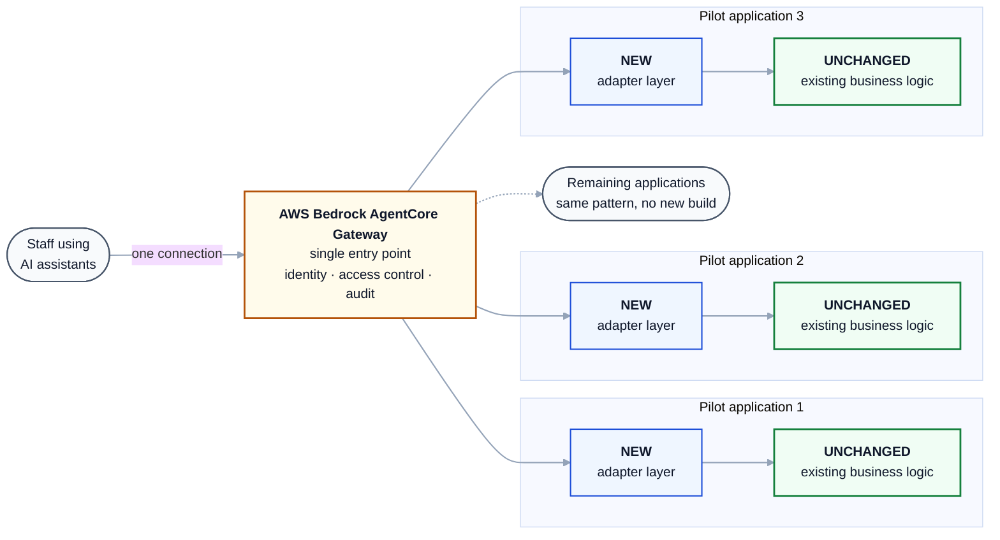

# Exposing existing .NET applications to AI agents

**In one sentence:** we add a thin layer to each existing application so AI agents can use its
functions, and route everything through one central gateway, without rewriting or replacing the
applications themselves.

## What the diagram says

**Green stays as it is.** The business rules your organisation has built and validated over years are not
rewritten, reimplemented, or migrated. They keep running in place, in the same code, producing the
same answers. This is the central point: rewriting working institutional logic is how organisations
introduce errors into processes that were already correct.

**Blue is what we add.** A small, standard layer per application that describes which functions are
available and lets them be called. It is additive, and no existing code is edited.

**Amber is the single control point.** Every request passes through one gateway. Identity is verified
there, access is granted per application, and every call is logged. Adding the fourth or fifth
application does not create a fourth or fifth integration to secure and monitor.

## Why this approach

| | |
|---|---|
| **Preserves investment** | Years of encoded process logic keep working, untouched |
| **Scales predictably** | Onboarding further applications is configuration, not a new project |
| **Centralises control** | One place for identity, authorisation and audit across the estate |
| **Reversible** | Disabled by default per application; switching it off restores the prior state exactly |

## Security in brief

- Inactive until explicitly enabled on each application, and refuses all traffic without a credential.
- Read-only unless a specific function is deliberately approved for making changes.
- Existing permissions still apply. The gateway confirms *who* is asking; each application continues
  to decide *what* they may do, using the access rules it already enforces.
- Every call is recorded with who called it and what they invoked.

## Status and the ask

The core platform is complete and automatically tested. The remaining technical unknown is validating
the layer inside a live hosting environment, which is the purpose of the first pilot.

To proceed we need confirmation of the three pilot applications, a test environment, and a decision on
whether agents should act as individual staff members or under a single service identity.

---

*Engineering detail, including request flow, validation gates and the identity sequence, is in
[`architecture.md`](architecture.md).*
