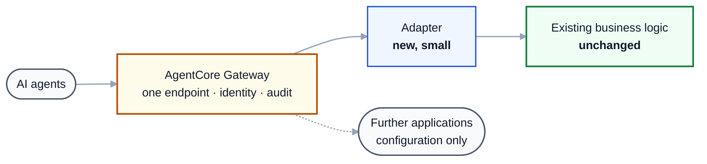

# McpToolAdapter: MCP for traditional .NET platforms

Makes functions inside existing ASP.NET Framework applications callable by AI agents, through one central
AWS Bedrock AgentCore Gateway, without rewriting the applications.

## The problem

Most institutional logic in a mature .NET estate lives in ASP.NET Framework applications, typically
WebForms and MVC 5, that have run correctly for years. Agents cannot reach it. The default path is to
rewrite that logic as a modern service, which means re-deriving and re-validating rules that were already
correct, one application at a time. It is slow, and it puts risk into processes that had none.

The official MCP C# SDK does not close this gap. Its HTTP hosting ships only .NET 8, 9 and 10 assets, so
it cannot run where these applications live.

## How it works

1. Declare. One new file per application lists which existing methods to expose. No existing code is
   edited.
2. Describe. At startup the application reflects over those methods, generates JSON Schema for their
   inputs and outputs, and serves an OpenAPI document at `/_mcp/openapi.json`. Because it is generated
   from the code, it cannot drift from it.
3. Register. AgentCore Gateway consumes that document as an OpenAPI target, and each operation becomes an
   MCP tool. Registration is automated and idempotent.

## What it accelerates

| | Rewrite approach | With McpToolAdapter |
|---|---|---|
| First application | Reimplement and revalidate business rules | One file plus four configuration entries |
| Each further application | Another project | A configuration entry |
| Keeping tools current | Manual, drifts from code | Generated from code, and registration reconciles automatically |
| Integrations to secure | One per application | One gateway for the estate |
| Risk to business rules | Re-derived, so divergence is possible | Untouched, so behaviour is identical |

There is one variable. Where logic sits in page code-behind rather than in service classes, it has to be
lifted into a callable method first. That ratio drives the effort per application, and it is assessed
before estimating.

## AgentCore integration

- One OpenAPI target per application. Separate targets mean access can be granted to one application's
  tools without the others, and a change to one application cannot invalidate another.
- Inbound identity at the gateway. JWT validation of audience, client and scope, configured once.
- Outbound credential injected by the gateway. Either an API key for service-account access, or OAuth
  token exchange to carry the end user's identity through to the application.
- Compatibility validated before deployment. AgentCore's constraints are checked at application startup
  and again at registration. That includes the 64-character tool-name limit, which otherwise fails at
  invocation rather than at registration.
- Infrastructure as code. The gateway, credentials and tool targets all deploy as CloudFormation,
  including targets reached privately over VPC Lattice. For applications deployed by something other than
  CloudFormation, a reconciler registers their targets idempotently from a manifest.

## Security posture

The endpoint is inactive until explicitly enabled per application, and refuses all traffic without a
credential. It is read-only unless an operation is deliberately approved for making changes. The gateway
authenticates; each application still authorizes using the access rules it already enforces. Every call is
audited with caller and operation, and argument values are excluded.

## Status

The core platform is complete, with 196 .NET and 30 Python automated tests, AgentCore compatibility
checks, and registration automation. The AgentCore round trip has been verified end to end in us-east-1
against a privately deployed application.

One thing remains unproven: the hosting layer running inside a live IIS application. That is the purpose
of the first pilot and the main technical risk.
